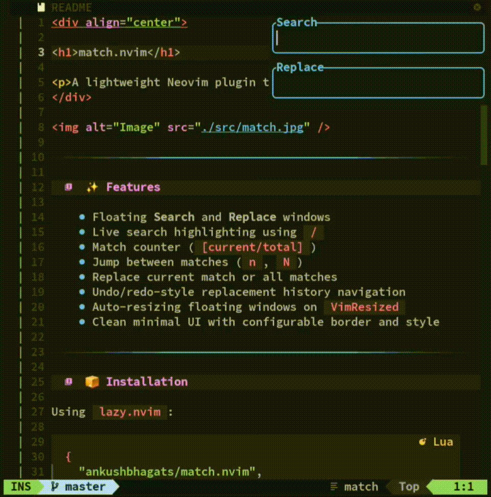

<div align="center">
<h1>match.nvim</h1>
<p>A minimal Neovim plugin for floating search & replace with live match tracking, navigation, and quick replacements.</p>
</div>



---

### ✨ Features

- Floating **Search** and **Replace** windows
- Live search highlighting using `/`
- Match counter (`[current/total]`)
- Jump between matches (`n`, `N`)
- Replace current match or all matches
- Undo/redo-style replacement history navigation
- Auto-resizing floating windows on `VimResized`
- Clean minimal UI with configurable border and style

---

### 📦 Installation

Using `lazy.nvim`:

```lua
{
  "ankushbhagats/match.nvim",
  config = true,
}
```

Using `packer.nvim`:

```lua
use {
  "ankushbhagats/match.nvim",
  config = function()
    require("match").setup()
  end
}
```

### Commands


| Command | Description |
|--------|-------------|
| `:Match {text}` | Open Match UI with given search text |
| `:MatchWord` | Open Match UI using word under cursor |
| `:MatchLine` | Open Match UI using current line |


### ⌨️ Keybindings


| Key | Action |
|-----|--------|
| `<Tab>` | Switch between search/replace |
| `<Esc>` / `<C-q>` | Close UI |


#### Search window

| Key | Action |
|-----|--------|
| `<Up>` | Jump to previous match |
| `<Down>` | Jump to next match |
| `<CR>` | Switch to replace window |


#### Replace window

| Key | Action |
|-----|--------|
| `<CR>` | Replace all matches |
| `<Up>` | Replace previous match |
| `<Down>` | Replace next match |
| `<C-u>` | Undo replacement |
| `<C-r>` | Redo replacement |


### ⚙️ Configuration

```lua
require("match").setup({
  prefix = "",
  style = "minimal",
  border = "rounded",
  border_hl = "Function",
})
```

### 🧠 How it works
- Search uses / register (`vim.fn.setreg("/")`)
- Matches tracked via `vim.fn.searchcount()`
- Replacements use :`substitute` internally
- Live updates via `buf_attach` (on_lines)
